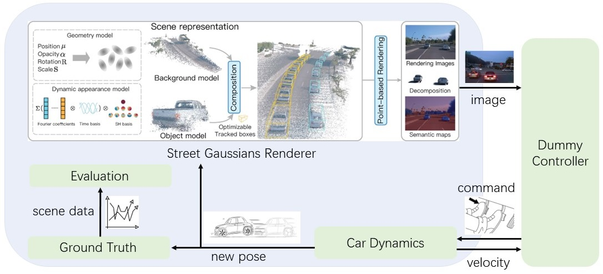
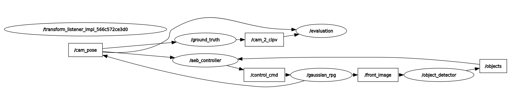
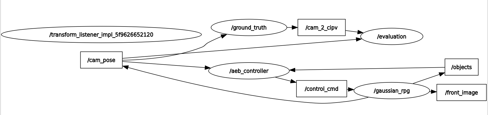

# GaussianRPG: 3D Gaussian Rendering PlayGround

This is an open-source autonomous driving closed-loop simulator demo using 3D Gaussian Splatting tech. The whole project is base on the codes from this paper:

> [Street Gaussians: Modeling Dynamic Urban Scenes with Gaussian Splatting](https://arxiv.org/abs/2401.01339)  
> Yunzhi Yan, Haotong Lin, Chenxu Zhou, Weijie Wang, Haiyang Sun, Kun Zhan, Xianpeng Lang, Xiaowei Zhou, Sida Peng  
> ECCV 2024

In this project, a simulator has been developed. Street_Gaussians is responsible for rendering images based on the camera position. A dummy AEB controller applies YOLOv5 to recognize cars in the images and determine the distance, issuing braking commands when appropriate. The car dynamics component within the simulator adjusts the camera position according to the braking commands and provides this information to Street_Gaussians as the basis for rendering the next frame. For convenience, ROS2 serves as the middleware providing the framework for the simulator.



### Examples:

Waymo Scene 002:

<video controls>
  <source src="https://github.com/GimpelZhang/GaussianRPG/tree/main/images/scene_waymo_002.mp4" type="video/mp4">
  Your browser does not support the video tag.
</video>

Waymo Scene 124:

<video controls>
  <source src="https://github.com/GimpelZhang/GaussianRPG/tree/main/images/scene_waymo_124.mp4" type="video/mp4">
  Your browser does not support the video tag.
</video>

Waymo Scene 149: 

<video controls>
  <source src="https://github.com/GimpelZhang/GaussianRPG/tree/main/images/scene_waymo_149.mp4" type="video/mp4">
  Your browser does not support the video tag.
</video>

### Installation

<summary>Environments of the repo</summary>

*ubuntu 22.04*

*GeForce RTX 3090*

<details> <summary>Clone this repository</summary>

```
git clone https://github.com/GimpelZhang/GaussianRPG.git
```
</details>

<details> <summary>Set up the python environment</summary>

```
# First make sure there is g++-11 in your system, if not:
sudo apt install g++

# Install mamba to manage environments:
conda install mamba -c conda-forge

# Set conda environment
mamba create -n street-gaussian-ros python=3.8
mamba activate street-gaussian-ros
conda config --env --add channels conda-forge
conda config --env --add channels robostack-staging
conda config --env --remove channels defaults

# Install ROS2 humble:
mamba install ros-humble-desktop
mamba deactivate
mamba activate street-gaussian-ros
mamba install compilers cmake pkg-config make ninja colcon-common-extensions catkin_tools rosdep
pip install setuptools==58.2.0

# Install torch (corresponding to your CUDA version)
pip install torch==2.1.2+cu118 torchvision==0.16.2+cu118 --extra-index-url https://download.pytorch.org/whl/cu118

# Install requirements
pip install -r requirements.txt
conda install ninja

# Install submodules
# Because of the ROS2 env, g++ is in version 12 in this conda env. 
# So next we can link to the g++-11 in our system directly: 
CC=/usr/bin/gcc CXX=/usr/bin/g++ pip install ./submodules/diff-gaussian-rasterization
CC=/usr/bin/gcc CXX=/usr/bin/g++ pip install ./submodules/simple-knn
CC=/usr/bin/gcc CXX=/usr/bin/g++ pip install ./submodules/simple-waymo-open-dataset-reader
CC=/usr/bin/gcc CXX=/usr/bin/g++ python script/test_gaussian_rasterization.py

# Build ROS2 nodes:
cd nodes
colcon build

# Further, if you want to train or to render using Street_Gaussians in this street-gaussian-ros conda env, 
# don't forget to add the g++-11 path before every command:
CC=/usr/bin/gcc CXX=/usr/bin/g++ python train.py --config configs/xxxx.yaml
CC=/usr/bin/gcc CXX=/usr/bin/g++ python render.py --config configs/xxxx.yaml mode {evaluate, trajectory}
```
</details>

<details> <summary>Prepare Waymo Open Dataset and others to run the simulator.</summary>

To run the GaussianRPG simulator, a trained Street_Gaussians model is needed. To render Street_Gaussians models, the training data folders are also needed. 

I provide all the data for the **examples** including: Waymo scene training data, trained outputs, and some **special files** inside them.

| baidunetdisk                                                            | google drive                                                                                                                 |
|-------------------------------------------------------------------------|------------------------------------------------------------------------------------------------------------------------------|
| [LINK](https://pan.baidu.com/s/1iGVjyEuZL5WBPI6ItpP5uQ)<br/> code: pcx4 | [LINK](https://drive.google.com/drive/folders/1ghpE_kBwqXiWgiSWAajByjPsmj1y0l)<br/> (Only including scene 149 training data) |

First prepare the Waymo training data:
```
data
└── waymo
    └── training
        └── 002
        └── 124
        └── 149
```
Then prepare the trained outputs:
```             
output
└── waymo_full_exp
    └── waymo_train_002_1cam
    └── waymo_train_124_1cam
    └── waymo_train_149_1cam
```
What are the **special files**?

1. Modified objects tracking info:

    Files like ./data/waymo/training/002/track/track_info.txt are modified so that novel motions are involved: the front cars can make AEB scenes. 

    **So if you want to train your own models using the data I provide, you can use the "track_info_original.txt" files instead in track folders. (rename "track_info_original.txt" -> "track_info.txt")**

2. Camera poses trajectory files:

    Files like ./output/waymo_full_exp/waymo_train_002_1cam/trajectory/ours_50000/cams_tape.json: camera poses for Street_Gaussians to render. 

If you want to prepare more Waymo scenes other than the examples, you can follow the procedure below:

1. Prepare the Waymo Open Dataset and train the models following the README in the original Street_Gaussian repo. (Codes in GaussianRPG can be used to complete the training as well.)
2. Use the **render_lite.py** script in GaussianRPG to make the cams_tape.json files:
    ```
    CC=/usr/bin/gcc CXX=/usr/bin/g++ python render_lite.py --config configs/example/XXXX.yaml mode trajectory
    ```  
3. Pick up the car that you want to edit and modify its pose in the track_info.txt. (A lot of manual work here. No tools for picking/edition yet.) 
4. Modify the config yaml file. (Config yaml files for the examples are provided)

</details>

### Run the gaussian_rpg simulator

#### 1. Separate perception mode:

Set the parameter "separate_perception" in the config yaml file to "true". Then:
```
cd nodes

# scene 002:
./scripts/simulator_launch_separate.sh ../output/waymo_full_exp/waymo_train_002_1cam/trajectory/ours_50000/cams_tape.json ../data/waymo/trai
ning/002/track/track_info.txt 98 6 waymo_train_002_1cam.yaml 10.0 2.0 24.0

# scene 124:
./scripts/simulator_launch_separate.sh ../output/waymo_full_exp/waymo_train_124_1cam/trajectory/ours_50000/cams_tape.json ../data/waymo/trai
ning/124/track/track_info.txt 0 57 waymo_train_124_1cam.yaml 7.0 2.0 20.0

# scene 149:
./scripts/simulator_launch_separate.sh ../output/waymo_full_exp/waymo_train_149_1cam/trajectory/ours_50000/cams_tape.json ../data/waymo/trai
ning/149/track/track_info.txt 10 21 waymo_train_149_1cam.yaml 8.0 2.0 21.0
```
In this mode, the simulator ROS2 node "gaussian_rpg" publishes the rendered image directly through ROS2 Image topic. The YOLOv5 perception module runs separately in the node "object_detector" which subscribes the Image topic. The rqt_graph below shows the framework of this mode. 



The ROS2 Image topic construction process in python is very slow, which makes the system running at about 1.15Hz. If we don't pass the image through rostopic, the system is able to run in a higher speed. 

#### 2. Not separate perception mode:

Set the parameter "separate_perception" in the config yaml file to "false". Then:
```
cd nodes

# scene 002:
./scripts/simulator_launch.sh ../output/waymo_full_exp/waymo_train_002_1cam/trajectory/ours_50000/cams_tape.json ../data/waymo/trai
ning/002/track/track_info.txt 98 6 waymo_train_002_1cam.yaml 10.0 2.0 24.0

# scene 124:
./scripts/simulator_launch.sh ../output/waymo_full_exp/waymo_train_124_1cam/trajectory/ours_50000/cams_tape.json ../data/waymo/trai
ning/124/track/track_info.txt 0 57 waymo_train_124_1cam.yaml 7.0 2.0 20.0

# scene 149:
./scripts/simulator_launch.sh ../output/waymo_full_exp/waymo_train_149_1cam/trajectory/ours_50000/cams_tape.json ../data/waymo/trai
ning/149/track/track_info.txt 10 21 waymo_train_149_1cam.yaml 8.0 2.0 21.0
```
In this mode, the YOLOv5 perception module is inside the gaussian_rpg node. The rendered result of Street_Gaussians runs directly into YOLOv5 model, which makes the system running about 5-6Hz. The rqt_graph is below:



Note that I didn't implement any optimization in the whole python YOLOv5 perception process, so the simulator system is not running at expected "real-time" speed (images in Waymo dataset have frequency 10Hz). However, the rendering speed of Street_Gaussians itself is much higher than that of GaussianRPG (>20-30Hz on 3090). 

Therefore, I believe that with well-designed software engineering, gaussian splatting based simulator in future will definitely become a real-time test bench for Software-In-Loop simulation, or even Hardware-In-Loop simulation. 

#### Arguments:

Here are the definitions of the shell script arguments:

```
$1: camera pose trajectory file path.

$2: objects tracking info file path.

$3: start frame id for the scene, the 1st element in "selected_frames" in the config yaml file.

$4: the track_id of the cipv front car in the track_info.txt file.

$5: config yaml file name. 

$6: the simulation time (s).

$7: the collision distance threshold (m).

$8: the braking distance threshold (m), in dummy controller, there is no TTC concept, so the braking distance is made as an argument.
```
### Acknowledgments
The original Street_Gaussians work: [Street Gaussians](https://github.com/zju3dv/street_gaussians). 

The whole YOLOv5 objects and distance detection module comes from: [yolov5_Distance_Detect](https://github.com/genqiaolynn/yolov5_Distance_Detect).
